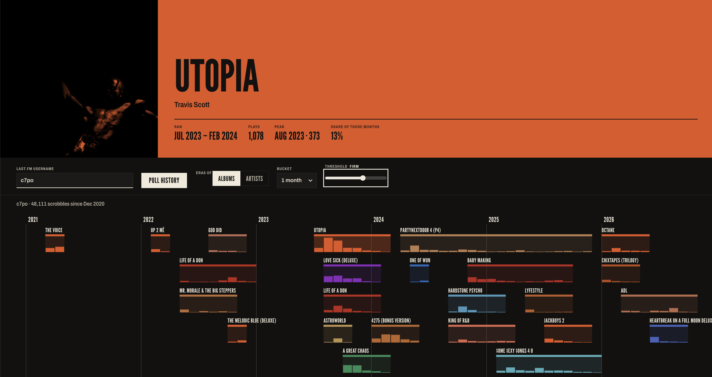
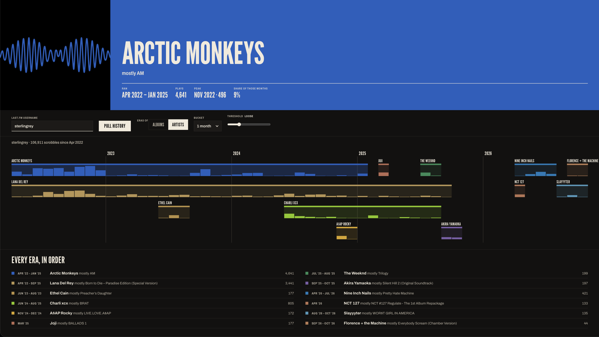

# Eras

Your Last.fm history as a timeline of eras: the albums and artists that ran each stretch of your listening.

Static, browser-only. https://eras.matranc.com





## Run locally

```sh
echo 'window.LASTFM_KEY = "your-key";' > src/config.js   # gitignored
cd src && python3 -m http.server 8642
```

Open http://localhost:8642. Test the era logic with `node test.js`.

## Deploy

Pushing to `main` deploys `src/` to GitHub Pages. One-time setup: add a repo secret `LASTFM_API_KEY`, and set Settings → Pages → Source to "GitHub Actions".
The key never lands in a git branch. It's still visible in the live site's network requests, as with any browser-only app.

## License

[AGPL-3.0](LICENSE)
